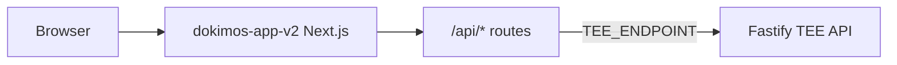

# Dokimos TEE

**Dokimos** is a demonstration of **verify-once identity**: users complete ID capture and liveness once; the system returns **cryptographic attestations** (signed messages) that relying parties can check without receiving raw documents. Verification logic is modeled as running in a **Trusted Execution Environment (TEE)** and exposed through a **Fastify** API; the **product UI** is a **Next.js** app that keeps TEE URLs and secrets on the server via **BFF (Backend-for-Frontend) routes**.

This repository is intended for **demos, research, and integration experiments**, not as a drop-in production identity provider without further hardening. Read [SECURITY.md](./SECURITY.md) before deploying or publishing.

---

## What lives in this repo

| Path | Role |
|------|------|
| **`dokimos-app-v2/`** | **Canonical app** — Next.js 14 (App Router), marketing site, consumer vault flow, verifier dashboard demo, integration page, NextAuth, and `/api/*` proxies to the TEE. **Run the product UI from here.** |
| **`src/index.ts`** (repo root) | **Fastify TEE backend** — OCR, face match, signing, in-memory users/verifiers/requests, seeded demo data. Default **`npm run dev`** → **http://localhost:8080**. |
| **`dokimos-app/`** | **Older Next.js app** — legacy routes and experiments; not the supported product surface. |
| **`app/`**, **`DokimosFlow.tsx`** (repo root) | **Early prototype** shell; superseded by `dokimos-app-v2/`. |
| **`pencil-new.pen`**, **`pencil-new-2.pen`** | **Pencil** design sources (optional; for design tooling). |

---

## Architecture (mental model)



- The **browser** only talks to the **Next.js origin** (e.g. port **8081**).
- **Client code** calls same-origin **`/api/...`**; **route handlers** forward to **`TEE_ENDPOINT`** (your Fastify process). That keeps the raw TEE URL and server-side concerns off the client bundle.
- **NextAuth** runs in the Next app; the Fastify server holds demo **users**, **verifiers**, and **verification requests** (in-memory for this prototype).

---

## Quick start (local)

You need **two processes**: the TEE API and the Next app.

**1. TEE backend (repository root)**

```bash
npm install
npm run dev
```

Listens on **http://localhost:8080** by default (see `src/index.ts` if you change the port).

**2. Next.js app (`dokimos-app-v2`)**

```bash
cd dokimos-app-v2
npm install
npm run dev
```

Opens **http://localhost:8081** (see `package.json`).

**3. Point the app at your local TEE**

Copy `dokimos-app-v2/.env.example` to **`dokimos-app-v2/.env.local`** and set:

```bash
TEE_ENDPOINT=http://localhost:8080
NEXTAUTH_URL=http://localhost:8081
```

Generate `NEXTAUTH_SECRET` (e.g. `openssl rand -base64 32`) and add Google OAuth credentials if you want real Google sign-in. Demo credential login is available for scripted flows; see `dokimos-app-v2/src/lib/demoConsumerAccounts.ts` and [SECURITY.md](./SECURITY.md).

---

## Environment variables (high level)

| Variable | Where | Purpose |
|----------|--------|---------|
| `TEE_ENDPOINT` | `dokimos-app-v2/.env.local` | Fastify base URL for BFF proxies. When unset, code may fall back to a default remote TEE or localhost depending on environment — prefer setting explicitly for local dev. |
| `NEXTAUTH_URL` / `NEXTAUTH_SECRET` | `dokimos-app-v2/.env.local` | NextAuth session URL and encryption secret. |
| `GOOGLE_CLIENT_ID` / `GOOGLE_CLIENT_SECRET` | `dokimos-app-v2/.env.local` | Google OAuth for end users. |
| `MNEMONIC` | Root `.env` (Fastify) | Ethereum signer for attestations — **protect like a hot wallet key**; use a dedicated demo mnemonic. |
| `EIGEN_APP_ID` | Optional | Overrides default Eigen app id for attestation checks. |

Details and templates: **`dokimos-app-v2/.env.example`**, root **`.env.example`**.

---

## Routes you actually demo

| URL | What |
|-----|------|
| **`/`** | Marketing landing (`DokimosLanding`). |
| **`/onboarding`** | Consumer onboarding: ID upload → liveness → TEE verify → vault. |
| **`/app/vault`**, **`/app/requests`**, **`/app/settings`** | Signed-in app shell (vault, activity, settings). |
| **`/business`** | Verifier dashboard (demo data + optional live request panel). |
| **`/integration`** | Developer-oriented integration narrative and test hooks. |

Screen-by-screen copy, navigation, and API triggers are documented in:

- [`dokimos-app-v2/docs/demo-script-source-kit.md`](./dokimos-app-v2/docs/demo-script-source-kit.md) — consumer journey  
- [`dokimos-app-v2/docs/demo-business-verifier-source-kit.md`](./dokimos-app-v2/docs/demo-business-verifier-source-kit.md) — verifier / integration / seeded backend  

Product intent and positioning: [`dokimos-app-v2/docs/PRD.md`](./dokimos-app-v2/docs/PRD.md).

---

## API surface (Next BFF → Fastify)

The Next app implements **`/api/verify`**, **`/api/re-verify`**, **`/api/approve-request`**, **`/api/request-verification`**, user and verifier request listings, verifier auth proxies, **`/api/verify-attestation`**, and NextAuth. Clients should use **relative** `/api/...` URLs so cookies and origin stay consistent.

---

## Tech stack

- **Frontend:** Next.js 14 (App Router), React 18, TypeScript, Tailwind CSS, Framer Motion, NextAuth.  
- **Backend:** Fastify, Zod, Tesseract.js OCR, face matching (TensorFlow.js / face-api style pipeline), viem for signing.  
- **Deploy:** Next app is Vercel-friendly; set `TEE_ENDPOINT` and auth secrets in the host project. Do not expose private TEE URLs to the browser as public env vars unless that is intentional.

---

## Troubleshooting

- **Next 500s or stale modules after a pull:** delete `dokimos-app-v2/.next` and restart `npm run dev`.  
- **Verification or requests fail:** confirm Fastify is running and `TEE_ENDPOINT` in `.env.local` matches its URL.  
- **Camera / CSP issues in dev:** see comments in `dokimos-app-v2/next.config.js` (CSP `connect-src` for local websockets).

---

## Contributing and cleanup

- **Secrets:** never commit `.env`, `.env.local`, or keys. `.gitignore` already excludes them; run `git grep` for accidental API keys before pushing.  
- **Legacy folders:** prefer changes in **`dokimos-app-v2/`** unless you are explicitly maintaining legacy code.

---

## License and security

Treat this codebase as **demo-grade** until you complete production hardening (database, session store, real TEE attestation verification, operational monitoring). See **[SECURITY.md](./SECURITY.md)** for limitations and checklist items.
