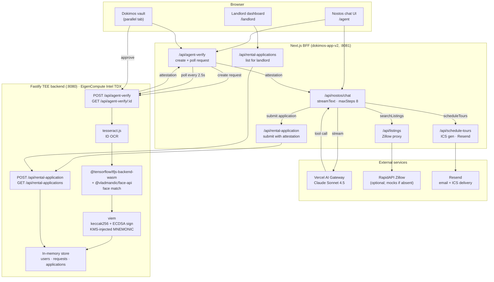

# Nostos

Every time you apply for an apartment, you upload the same ID, the same pay stubs, the same documents to a portal you'll never use again. The landlord's assistant manually checks the same things. Then you apply to the next place and do it all over. The friction is real, the re-verification is pointless, and sooner or later one of those portals gets breached. Nostos is built on a different premise: you tell an agent what you're looking for, it finds apartments, books tours, and sends calendar invites — and when you're ready to apply, your verified identity travels with you as a cryptographic credential. No re-uploading. No handing documents to strangers. No paper trail sitting in a database somewhere.

---

## How it works

Nostos has two sides: a conversational agent for tenants and a review dashboard for landlords. Both are powered by the same Dokimos identity vault running on a Fastify backend inside a Trusted Execution Environment.

### The tenant flow

The experience starts at `/agent` as a chat. The agent — Claude Sonnet running through the Vercel AI Gateway — asks a short sequence of questions: where you work or want to commute to, what kind of apartment you want, how much you're willing to spend, and when you're free to tour. It's a conversation, not a form. You answer however you'd naturally answer, and the agent figures out the structure.

Once it has enough to work with, the agent calls `searchListings` — a real tool call to a Zillow data API — and surfaces matching apartments with photos, addresses, and prices. You pick the ones you want to see. The agent calls `scheduleTours`, parses your availability into concrete time slots, builds RFC 5545-compliant `.ics` calendar files for each tour, and sends them to you and the landlord via Resend. Both parties get a calendar invite with the address, tour time, and a Google Maps link. No back-and-forth over email.

When you're ready to apply, the agent hands off to the Dokimos identity vault. A verification request is created in the TEE backend and you're directed to open your vault in a separate tab to approve it. The vault runs OCR on your stored ID via tesseract.js, confirms liveness via a TensorFlow.js face-matching pipeline, and signs a set of extracted attributes — your name, whether you're over 18, your address, whether the document is still valid — using an Ethereum wallet whose private key is bound to the running hardware. The attestation comes back to the agent within seconds, and the application is submitted with that signed credential attached.

### The landlord flow

Landlords visit `/landlord` and see a table of submitted applications: who applied, to which listing, and when. Every row is clickable. A VerificationWizard modal opens showing exactly what the TEE verified — full name, age confirmation, address, document expiry — along with the timestamp and the cryptographic signature. The landlord gets a clear, auditable record of what was checked. They don't get the tenant's actual ID. They don't need it.

The dashboard polls for new applications every twelve seconds, so there's no manual refresh needed during a demo or a live screening session.

---

## Architecture



---

## What's real vs. what's placeholder

The AI agent is real. It calls Claude Sonnet via the Vercel AI Gateway, executes genuine tool calls, and streams responses back to the client. The tour scheduling emails are real: Resend delivers them, and the `.ics` attachments land in both the tenant's and landlord's calendars. The ECDSA signatures on attestations are real — they're generated by viem from a wallet derived from the KMS-injected `MNEMONIC`, and they're independently verifiable on Etherscan. The OCR pipeline is real (tesseract.js running in-process) and the face matching is real (@tensorflow/tfjs-backend-wasm plus face-api running descriptor-distance comparison).

The TEE attestation quote fields — `mrenclave`, `tcbStatus` — are structurally correct Intel TDX format, but contain simulated values. EigenCompute does not yet expose the hardware quote to running applications, so the code generates well-formed quote objects and documents this honestly in a `note` field on every attestation response. The onchain deployment record and the Verifiability Dashboard entry are real.

All application state, user data, and verification requests live in-memory. The process forgets everything on restart. This is fine for a demo; a production deployment would swap in a database and a session store. The three Brooklyn listings are hardcoded mock data; connecting a `RAPIDAPI_KEY` switches the agent to live Zillow results. The demo user accounts seeded in the backend are documented in `SECURITY.md`.

---

## Tech stack

- **Next.js 14 (App Router)** — frontend and BFF API routes; all TEE URLs and secrets stay server-side
- **Claude Sonnet 4.5 via Vercel AI Gateway** — the agent's reasoning, conversation management, and tool orchestration
- **Vercel AI SDK** (`ai`, `@ai-sdk/openai`) — `streamText` with `maxSteps: 8` controls the agentic loop and wires tool calls back into the stream
- **Fastify** — TEE backend API; handles all identity verification, signing, and application storage
- **tesseract.js** — in-process OCR for extracting name, address, and expiry from uploaded ID documents
- **@tensorflow/tfjs-backend-wasm + @vladmandic/face-api** — face-descriptor comparison for liveness; WASM backend because `tfjs-node` fails to build on `linux/amd64` Alpine
- **viem** — Ethereum ECDSA signing of attestation payloads; wallet derived from KMS-injected BIP-39 mnemonic
- **NextAuth** — Google OAuth and demo credential login; sessions via httpOnly cookies
- **Resend** — sends tour confirmation emails with RFC 5545 `.ics` calendar attachments to tenant and landlord
- **node-canvas** — native image processing dependency required by TensorFlow.js face pipeline
- **Docker / Node 22 Alpine** — backend containerization; Alpine chosen for size, with Cairo/Pango headers for node-canvas
- **Vercel** — frontend deployment; `NOSTOS_PRIMARY_SITE=1` at build time makes `/` redirect to `/nostos`

---

## Running locally

Two processes are required. Start them in separate terminals.

**Terminal 1 — TEE backend (repo root)**

```bash
npm install
npm run dev
```

Starts Fastify on **http://localhost:8080**. Copy `.env.example` to `.env` and fill in:

```bash
# Required: BIP-39 mnemonic for the attestation signing wallet (use any fresh mnemonic locally)
MNEMONIC=word1 word2 word3 ... word12
```

The `MNEMONIC`-derived wallet is only meaningful inside EigenCloud's hardware; locally it produces valid ECDSA signatures that are not backed by a hardware attestation.

**Terminal 2 — Next.js frontend (`dokimos-app-v2/`)**

```bash
cd dokimos-app-v2
npm install
npm run dev
```

Starts Next.js on **http://localhost:8081**. Copy `dokimos-app-v2/.env.example` to `dokimos-app-v2/.env.local`:

```bash
# Required
NEXTAUTH_SECRET=                        # openssl rand -base64 32
NEXTAUTH_URL=http://localhost:8081
TEE_ENDPOINT=http://localhost:8080

# Optional — demo works without these, but with reduced functionality
GOOGLE_CLIENT_ID=                       # real Google sign-in
GOOGLE_CLIENT_SECRET=
AI_GATEWAY_API_KEY=                     # Claude agent; chat will fail without this
RAPIDAPI_KEY=                           # live Zillow listings; falls back to 3 mock Brooklyn apartments
RESEND_API_KEY=                         # real tour emails; skipped if absent
```

Visit **http://localhost:8081/agent** to start the rental agent. The landlord dashboard is at **http://localhost:8081/landlord**. Demo credentials are documented in `SECURITY.md`.

**Docker (backend only)**

```bash
docker build --platform linux/amd64 -t nostos-tee .
docker run -p 8080:8080 --env-file .env nostos-tee
```

---

## Live deployment

The frontend is deployed on Vercel. The Fastify backend runs on EigenCompute (Intel TDX via EigenCloud) as a containerized workload.

- **App ID:** `0x00658E70d8880910277592b3B41F9dD3FE4Ce5Fd`
- **EigenCloud Verifiability Dashboard:** [verify-sepolia.eigencloud.xyz/app/0x00658E70d8880910277592b3B41F9dD3FE4Ce5Fd](https://verify-sepolia.eigencloud.xyz/app/0x00658E70d8880910277592b3B41F9dD3FE4Ce5Fd) — shows the onchain deployment record for this specific Docker image running on this specific hardware, including the build hash and TEE measurement fields
- **Etherscan verified signatures:** [etherscan.io/verifiedSignatures?a=0x4E1B03A5678C52075A7271AfcF4c44e26f64ef35](https://etherscan.io/verifiedSignatures?a=0x4E1B03A5678C52075A7271AfcF4c44e26f64ef35) — shows every attestation signature produced by the KMS-bound wallet since deployment

---

## Security and production hardening

This codebase is demo-grade. Before any production deployment: swap in-memory storage for a real database and session store, complete Intel DCAP quote verification once EigenCompute exposes hardware quote data, rotate demo credentials, and read [SECURITY.md](./SECURITY.md) in full.
