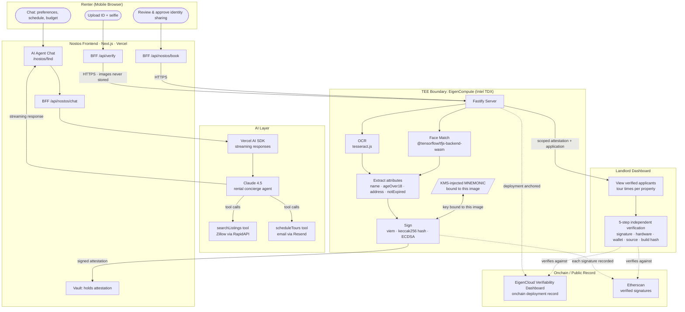

# Nostos

Every time you apply for an apartment, you hand a stranger your passport. The landlord at the place on Crosby Street gets the same package as the one on Flatbush Avenue: full name, date of birth, home address, a scan of your government ID. Multiply that by every rental application you've ever submitted and you've handed your identity to dozens of people you've never met, stored in dozens of databases you'll never audit. Nostos is built on a different premise: verify your identity once inside secure hardware, then share cryptographic proof with landlords instead of documents. The landlord sees a signed statement that you are who you say you are and that your document is valid. They never see the document itself.

Nostos is a NYC rental search and application platform with a privacy-preserving identity layer powered by Dokimos. A conversational AI agent (Claude) helps renters find apartments, books tours around their schedule, and then prompts a single identity verification that covers every application in that search. Landlords see verified applicants, tour times, and a five-step verification path they can follow independently, without trusting Nostos or anyone else.

---

## How it works

The system has two sides: a renter who searches for apartments and builds a vault of verified credentials, and a landlord who receives verified rental applications without collecting sensitive documents. The identity verification itself happens inside a Trusted Execution Environment running on EigenCompute's Intel TDX hardware, where neither the renter nor the developer nor the landlord can see or alter the computation.

### The renter flow

A renter opens Nostos and starts a conversation with the AI agent. The agent asks where they commute, what they need in an apartment, their budget, and when they're free for tours. It's a real conversation, not a form. Once it has enough to work with, the agent searches live listings and immediately schedules tours at times the renter actually said they were free, sending calendar confirmations by email.

After tours are booked, Nostos asks the renter to verify their identity once. The renter uploads a photo of their government ID and a selfie. Inside the TEE, tesseract.js reads the document and extracts structured fields (name, date of birth, address, expiry date) while the TensorFlow.js WASM face matcher compares the ID photo to the selfie. Neither image leaves the enclave. What comes out is a signed attestation: a JSON object containing the extracted attributes (name, ageOver18, address, notExpired), a face match result, a timestamp, and an ECDSA signature over a keccak256 hash of those exact fields. The attestation lives in the renter's vault.

When the renter approves an application, the TEE generates a fresh attestation scoped to that specific landlord request. The application is submitted with the attestation attached. The renter's actual ID never touches the landlord's system.

### The landlord flow

A landlord opens the Nostos landlord dashboard and sees their properties alongside the verified applicants who have submitted applications. Each applicant card shows tour details and a "Verified by Nostos" summary: name confirmed, age 18+ confirmed, address confirmed, document not expired. The landlord still collects credit reports, income verification, and references through their normal process. Nostos handles identity.

For landlords who want to verify the verification, there's a five-step path: check the ECDSA signature against the signer wallet on Etherscan, inspect the TEE hardware record on the EigenCloud Verifiability Dashboard, confirm the wallet address is bound to this specific deployment, review the source code on GitHub, and verify the Docker build hash. None of those steps require trusting Nostos.

---

## Architecture



The TEE boundary is the key constraint: images go in, structured claims and a signature come out. The AI agent layer and the identity layer are separate; Claude never sees the ID.

---

## What's real vs. what's simulated

**Real and independently verifiable:**

The ECDSA signing is fully live. Every attestation the TEE produces is signed by a wallet whose address is derived from a mnemonic injected by EigenCloud's KMS at deploy time, and those signatures are publicly visible on Etherscan. Any party holding an attestation can reconstruct the keccak256 hash of the claims, call `ecrecover`, and confirm the signer matches that wallet address, with no Nostos infrastructure required.

The KMS wallet is real. The mnemonic is bound to the specific Docker image hash: a different image produces a different wallet address. That binding is what makes the signing wallet meaningful rather than arbitrary. It's not a key Nostos holds somewhere; it's a key that provably came from this code on this hardware.

The onchain deployment record is real. The EigenCompute app ID is registered on Sepolia, and the EigenCloud Verifiability Dashboard shows the live deployment state against that record.

**What's simulated:**

The TEE quote fields in each attestation response (`mrenclave`, `tcbStatus`, and related Intel TDX fields) are structurally correct but contain simulated values. EigenCompute's platform doesn't yet expose the hardware-generated quote to applications running inside the enclave, so the code generates a well-formed placeholder and documents this honestly in a `note` field on every attestation response. When the platform surface becomes available, replacing the simulated quote with a real one is the only code change needed. The signing, the OCR, and the face match are all running on real hardware today; the limitation is that the enclave can't yet reach back and ask the hardware to sign a quote of itself.

---

## Tech stack

- **Next.js 14 (App Router):** Mobile-first frontend for both the renter search experience and the landlord dashboard. BFF routes proxy to the TEE and to the AI layer, keeping credentials and endpoint URLs server-side.
- **Claude 4.5 via Vercel AI SDK:** Powers the Nostos rental concierge agent. Follows a structured conversation flow to gather preferences, calls listing and scheduling tools, and streams responses back to the browser. The agent never sees identity documents.
- **Fastify:** TEE backend API. Handles OCR, face matching, signing, rental application records, and in-memory user/verifier state. Deployed to EigenCompute on port 8080.
- **EigenCompute (Intel TDX via EigenCloud):** Confidential compute platform. The Docker image is deployed to a TDX enclave; the KMS injects the signing mnemonic at runtime, bound to that exact image hash.
- **viem:** Ethereum library for mnemonic-to-account derivation and ECDSA signing over keccak256 hashes. Also used in the frontend for attestation verification.
- **tesseract.js:** WASM-based OCR that reads structured text from ID document images inside the enclave.
- **@tensorflow/tfjs-backend-wasm:** TensorFlow.js running on WASM instead of native bindings. tfjs-node failed to build on the Alpine linux/amd64 target because of native module compilation constraints, so WASM is the production backend.
- **node-canvas:** Provides a Canvas API for Node.js so face-api can process images server-side without a browser.
- **Resend:** Sends tour confirmation emails to renters after the agent schedules viewings.
- **RapidAPI (Zillow Scraper):** Provides live NYC listing data for the agent's `searchListings` tool. Falls back to mock listings if unavailable.
- **Docker (Alpine, linux/amd64):** The enclave image. Alpine keeps the image small; the platform target is fixed to `linux/amd64` to match EigenCompute's runtime.
- **Vercel:** Hosts the Next.js frontend. `TEE_ENDPOINT` and `AI_GATEWAY_API_KEY` are set as server-side environment variables.

---

## Running locally

You need two processes: the TEE backend and the Next.js app.

**1. TEE backend (repository root)**

```bash
# Install dependencies (node-canvas requires native build tools on macOS/Linux;
# on macOS: brew install pkg-config cairo pango libpng jpeg giflib librsvg)
npm install
npm run dev
```

The server starts on `http://localhost:8080`.

**2. Next.js app**

```bash
cd dokimos-app-v2
npm install
npm run dev
```

The app starts on `http://localhost:8081`.

**3. Environment setup**

Copy `.env.example` to `.env` in the repo root:

```bash
# Root .env (TEE backend)
MNEMONIC=              # leave blank or use a throwaway mnemonic; see note below
PORT=8080
CORS_ORIGINS=http://localhost:8081
```

Copy `dokimos-app-v2/.env.example` to `dokimos-app-v2/.env.local`:

```bash
TEE_ENDPOINT=http://localhost:8080
NEXTAUTH_URL=http://localhost:8081
NEXTAUTH_SECRET=       # generate with: openssl rand -base64 32

# For the AI agent
AI_GATEWAY_API_KEY=    # Vercel AI Gateway key for Claude

# For live listings (optional; falls back to mock data)
RAPIDAPI_KEY=

# For tour confirmation emails (optional)
# Resend is called server-side; no key = tours booked silently
```

**4. Visit the Nostos product**

Navigate to `http://localhost:8081/nostos` to start the renter flow. The landlord dashboard is at `/nostos/landlord`.

To run Nostos as the primary landing page (redirects `/` to `/nostos`):

```bash
NOSTOS_PRIMARY_SITE=1
```

**A note on the signing wallet:** In the live deployment, the `MNEMONIC` is injected by EigenCloud's KMS and is cryptographically bound to the Docker image hash. Locally, you can supply any BIP-39 mnemonic and the backend will sign attestations with the derived wallet, but those signatures won't match the production address that appears on Etherscan, and the EigenCloud Verifiability Dashboard won't recognize the deployment. Local runs are useful for testing the conversation flow, OCR, face matching, and the attestation structure, not for generating externally verifiable proofs.

**5. Docker (optional)**

To reproduce the exact production environment:

```bash
docker build --platform linux/amd64 -t nostos-tee .
docker run -p 8080:8080 --env-file .env nostos-tee
```

The Dockerfile installs the native Cairo stack headers needed by node-canvas; this is why Alpine is the base rather than a lighter image.

---

## Live deployment

**App ID:** `0x0D8acDA0F105E926c362893DB2c3e6bC9473E436`

**[EigenCloud Verifiability Dashboard](https://verify-sepolia.eigencloud.xyz/app/0x0D8acDA0F105E926c362893DB2c3e6bC9473E436):** Shows the onchain deployment record for this app ID on Sepolia, including the registered Docker image hash and the KMS-bound signing address. This is the root of trust a landlord uses to confirm that an attestation came from the right code on the right hardware.

---

## Repository layout

| Path | Role |
|------|------|
| `src/index.ts` | Fastify TEE backend: OCR, face match, signing, rental application records, in-memory state |
| `src/faceVerification.ts` | TensorFlow.js WASM face match pipeline |
| `dokimos-app-v2/src/app/nostos/` | Nostos product routes: renter landing, conversational search, landlord dashboard |
| `dokimos-app-v2/src/app/api/nostos/` | BFF routes: AI chat streaming, booking, tour scheduling |
| `dokimos-app-v2/src/app/onboarding/` | Identity verification flow: ID upload, liveness, vault |
| `dokimos-app-v2/src/app/app/` | User vault, request management, settings |
| `dokimos-app-v2/src/app/business/` | Generic verifier dashboard (non-rental) |
| `Dockerfile` | Production enclave image (linux/amd64, Alpine) |
| `dokimos-app-v2/docs/` | Demo scripts, PRD, verification flow documentation |
| `context/` | Build notes and EigenCloud integration reference |

---

## Security posture

This codebase is a working demonstration, not a production rental platform. The in-memory state store means verification records and rental applications don't survive restarts. Before deploying to real users, you'd replace it with a persistent database, harden the NextAuth configuration, add real Intel TDX quote generation once EigenCompute exposes that surface, and wire up production-grade session management. See [SECURITY.md](./SECURITY.md) for the full hardening checklist.
