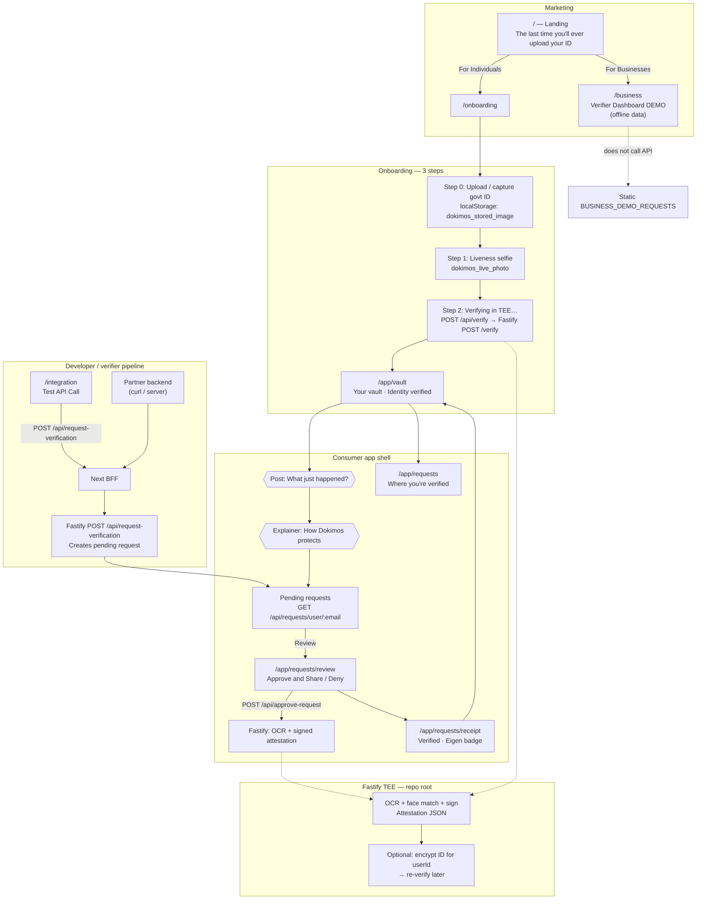
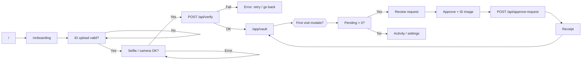
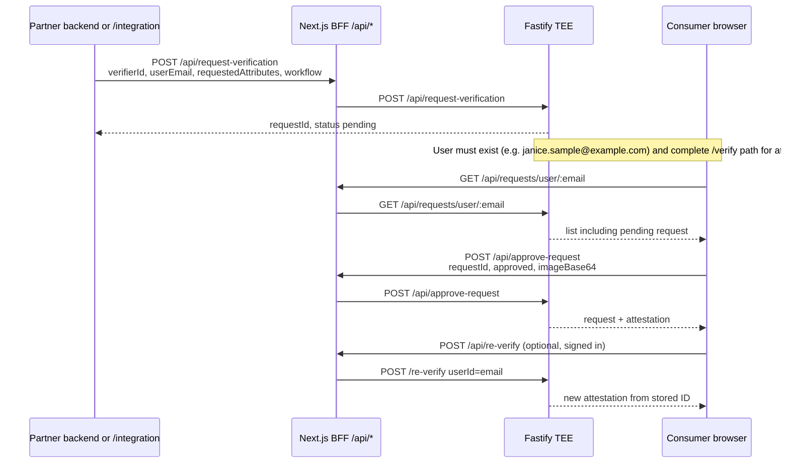
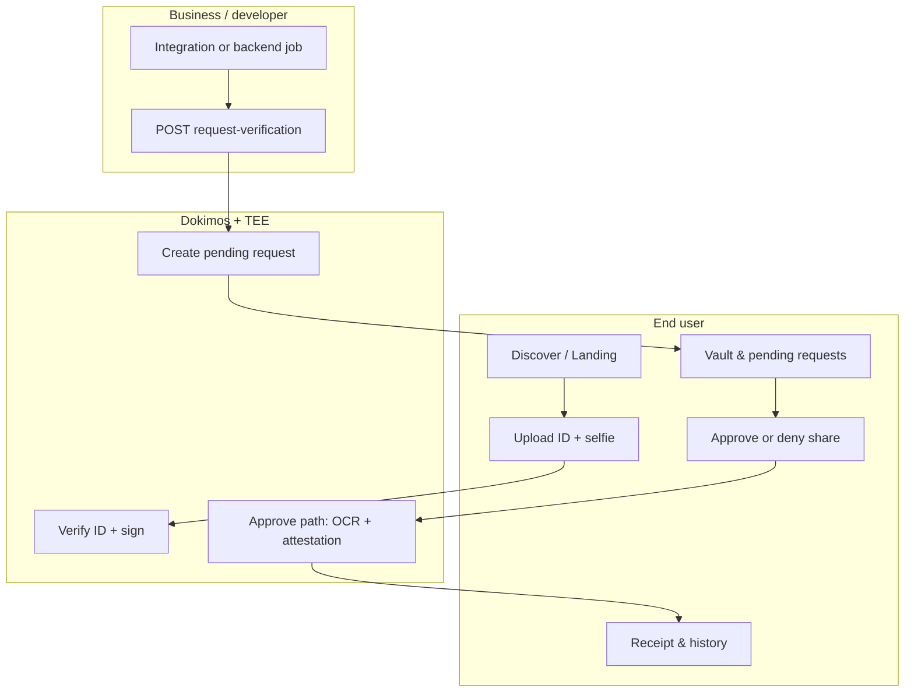

# Dokimos user journey diagrams

These diagrams synthesize the **consumer app**, **verifier/integration API**, and **Fastify TEE** behavior described in `demo-script-source-kit.md` and `demo-business-verifier-source-kit.md`.

Render with any Mermaid-compatible viewer (GitHub, VS Code Mermaid extension, [mermaid.live](https://mermaid.live)).

---

## 1. End-to-end journey (roles + major screens)

Shows how **Individual**, **Dokimos UI + Next BFF**, **TEE (Fastify)**, and **Business developer** interact. Solid lines = primary path; dashed = optional or demo-only UI.

---

## 2. Consumer journey only (screens + decisions)

---

## 3. Sequence: request → user approval → proof (technical)

---

## 4. Legend

| Symbol / area | Meaning |
|---------------|---------|
| **Next BFF** | Same-origin `/api/*`; proxies to `TEE_ENDPOINT` (default `http://localhost:8080`). |
| **`/business`** | Visual verifier dashboard; uses **offline** `BUSINESS_DEMO_REQUESTS`, not live `GET /api/requests/verifier/...`. |
| **`/integration` Test API** | **Live** `POST /api/request-verification` against seeded `airbnb_prod` + `janice.sample@example.com`. |

---

## 5. Simplified swimlane (one diagram)

